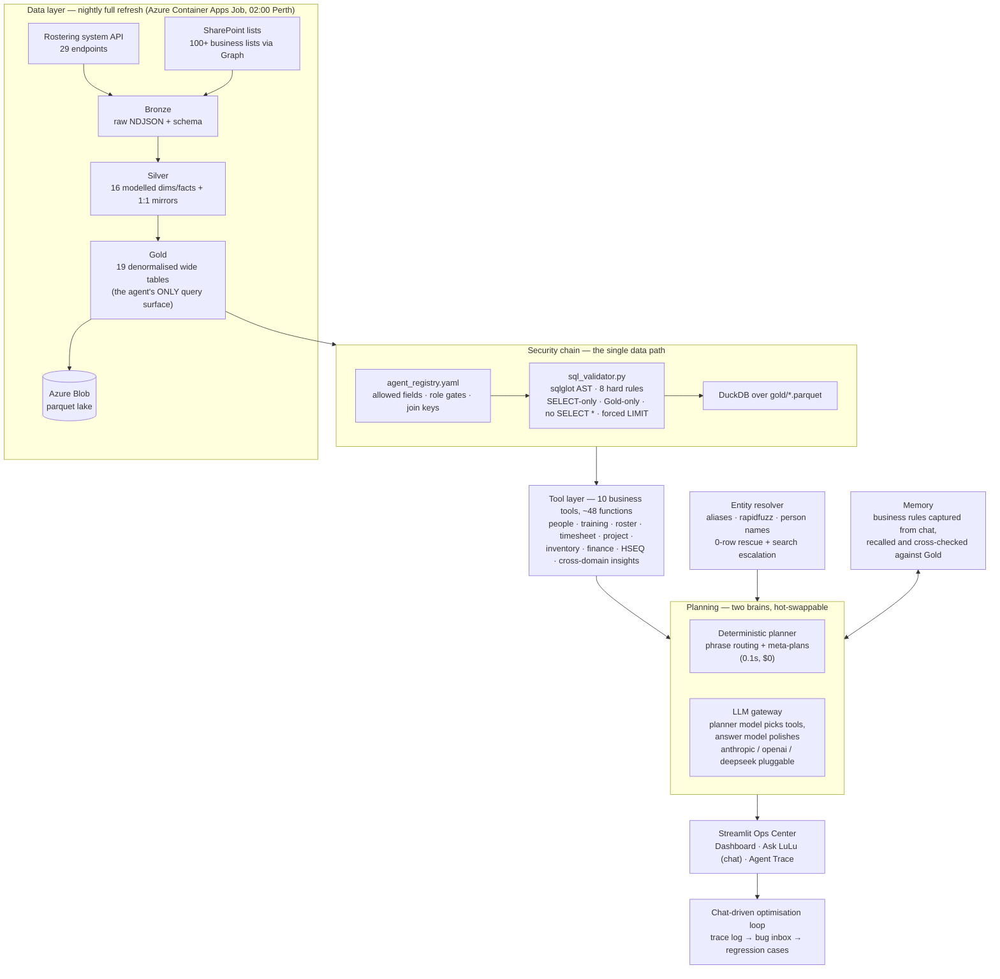

# LuLu — Workforce Operations AI Agent

A production AI operations agent for a labour-hire / mining-services business. A nightly pipeline reloads the company's rostering system and SharePoint lists into a bronze → silver → gold Parquet lake on Azure Blob; on top of that lake sits an agent that answers operational questions ("who can be deployed to site X?", "which rostered workers hold expired certs?", "what did we sign out of the store last month?") through a **hard SQL security chain — the LLM never writes free-form SQL**. It picks from ~48 registered business tools; every query those tools build is AST-validated against a semantic registry before DuckDB executes it.

> **Note:** This is a desensitised public copy. Company, client, supplier and worker names are illustrative placeholders; the data lake, logs, memory files and credentials are not included — so this copy is intentionally **not runnable as-is**. It shows the architecture and code, not live data.

---

## Architecture



---

## The security chain (the part I'm most proud of)

The LLM **cannot** execute arbitrary SQL. The only path to data is:

```
business tool → controlled SQL → sql_validator.validate() → DuckDB → gold/*.parquet
```

- `agent_registry.yaml` declares every queryable table: its allowed fields, role-restricted fields (PII / financial / audit), and the only join keys permitted
- `sql_validator.py` parses each statement with sqlglot and enforces 8 hard rules: SELECT-only, registered Gold tables only, allowed columns only, no `SELECT *`, forced `LIMIT`, no reads outside the lake, role gates on restricted fields
- Roles (default / HR_Manager / Finance / Admin_IT) are supplied by the caller, never chosen by the model
- A RAW debug channel exists for Admin_IT only: template-locked SQL, whitelisted table/column pairs, forced LIMIT, every access audit-logged

## Highlights

- **Deterministic + LLM dual planner** — common questions route through a zero-cost phrase planner with meta-plans that compose tools into executive reports (workforce risk, site readiness); everything else goes to a multi-provider LLM gateway where the planner model and answer model are swappable in one config line
- **Entity resolution & search escalation** — normalisation, hand-maintained alias table, fuzzy matching (auto-accept ≥90, ask-don't-guess at 70–90), full-name resolution against a live worker vocabulary; a 0-row result is never the final answer (intent self-check → re-query with canonical names → related-table probes → diagnostic reply)
- **Memory agent** — business rules stated in chat ("workers going to site X need certification Y") are captured, persisted, recalled on relevant questions and cross-checked against the lake
- **Chat-driven optimisation loop** — every Q&A lands in a trace log; failures are auto-classified into a bug inbox; one command promotes a bad conversation into a permanent regression case
- **Data quality sentinel** — post-pipeline checks on row counts, roster forward-window coverage, null rates and day-over-day KPI swings
- **Model gateway** — anthropic (native tool-use) / openai / deepseek / any OpenAI-compatible local server, with graceful fallback; swapping brains never touches business logic
- **Ops Center UI** — Streamlit app with a KPI dashboard, a chat page showing which tools ran and why, and a trace explorer

## Repo layout

```
agent/                  # the agent itself
├── sql_validator.py    # AST hard gate (8 rules, 13 tests)
├── agent_registry.yaml # semantic layer: tables, fields, roles, joins
├── query_tool.py       # the ONLY data path (validate -> DuckDB)
├── tools/              # 10 business tools, ~48 functions
├── planner.py / planner_v2.py    # deterministic router + meta-plans
├── llm_provider.py / *_provider.py / llm_agent_runner.py   # model gateway
├── entity_resolver.py / search_escalation.py / time_entity_parser.py
├── memory_manager.py   # capture / recall business rules
├── lulu_ops_center.py  # Streamlit UI
├── conversation_trace_logger.py / bug_inbox.py / regression_from_chat.py
└── test_*.py           # per-area test suites
pipeline/               # nightly lake refresh (Container Apps Job)
├── extract_opms.py / extract_sharepoint_bms.py
├── build_silver_gold.py / build_silver_flat.py
├── run_pipeline.py / pipeline_guard.py / upload_to_blob.py
└── Dockerfile / deploy_cloud.sh / REFRESH_STRATEGY.md
deploy/                 # Streamlit app container (Azure Container Apps)
```

## Technology stack

- **Python** — pandas, DuckDB, sqlglot, rapidfuzz, Streamlit
- **Azure** — Container Apps (app + scheduled job), Blob Storage (parquet lake), ACR cloud builds
- **Microsoft Graph** — SharePoint list extraction (100+ lists)
- **LLM** — Claude (native tool-use) with OpenAI / Deepseek / local fallbacks, config-swappable
- **Auth** — Entra ID sign-in on the cloud app; per-user roles feed the SQL security chain

## Purpose

Operations staff were answering the same questions every day by cross-referencing the rostering system, SharePoint registers and spreadsheets by hand. LuLu answers them in seconds — and because every answer must come through registered tools and a validated, role-gated SQL layer, giving people an AI assistant never meant giving the AI (or anyone chatting with it) uncontrolled access to workforce data.

Developed for internal business use.
