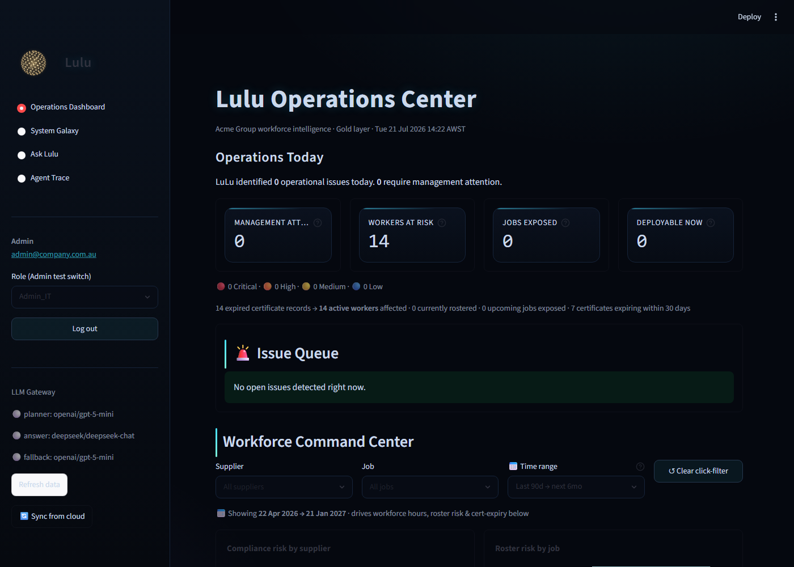
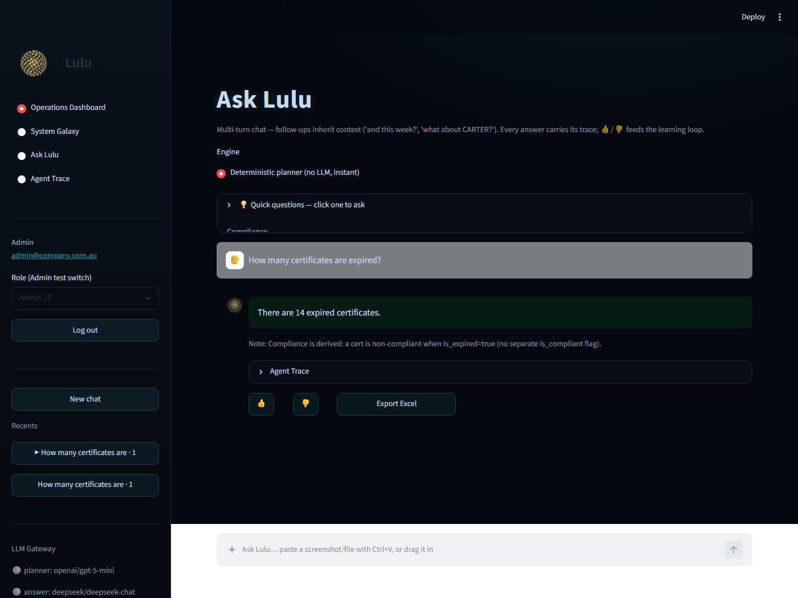
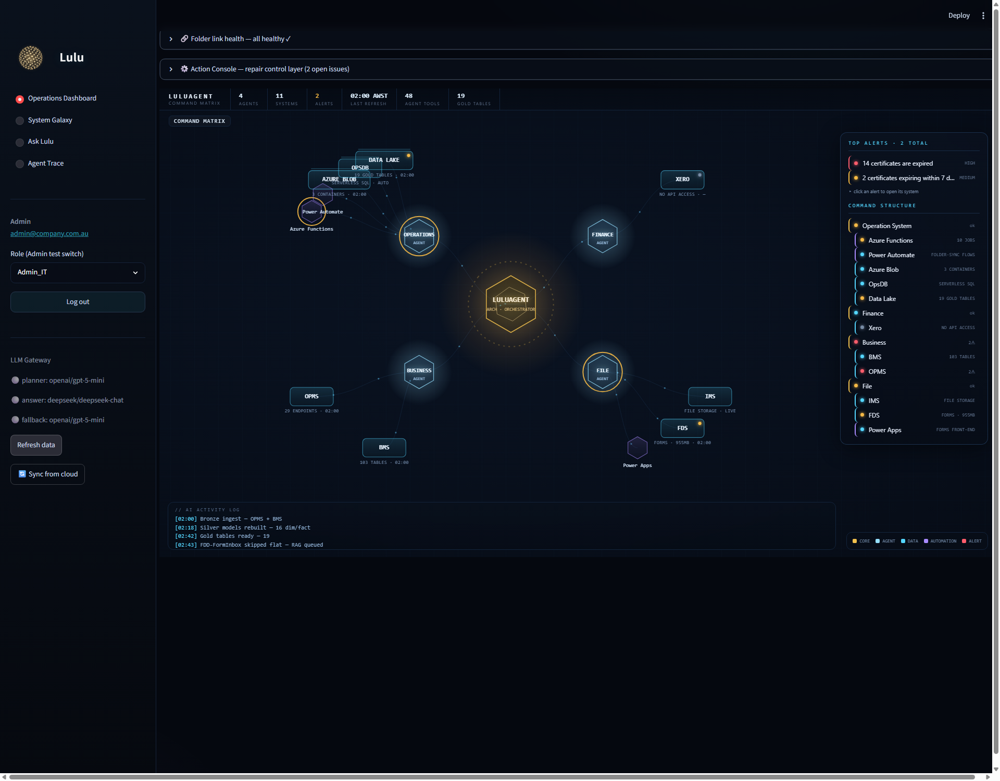
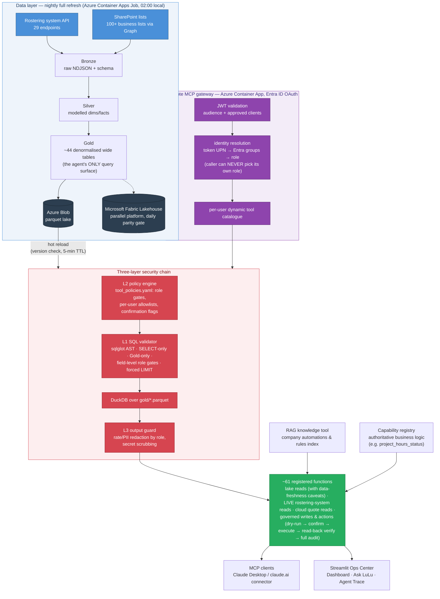

# LuLu — Workforce Operations AI Agent

A production AI operations platform for a labour-hire / mining-services business. A nightly pipeline reloads the company's rostering system and SharePoint lists into a bronze → silver → gold Parquet lake on Azure Blob; on top of that lake sits an agent that answers operational questions ("who can be deployed to site X?", "which rostered workers hold expired certs?", "how many hours has job Y burned against its quote?") through a **hard SQL security chain — the LLM never writes free-form SQL**.

**v3** turns the single-app agent into something more useful: **a security gateway that lets Claude (or any MCP client) safely operate over internal company systems**. Staff connect their everyday Claude to the gateway as a connector; LuLu authenticates them with Entra ID, decides which of ~61 registered business functions their role may even see, validates every query, redacts every response, and audits every call. The first **governed write and action tools** ship with dry-run, explicit confirmation, server-side identity injection and full audit. A **Microsoft Fabric lakehouse runs in parallel** with daily parity gates against the Azure Blob lake, with CI keeping both code paths in lock-step.

> **Note:** This is a desensitised public copy. Company, client, supplier and worker names are illustrative placeholders; tenant/app/workspace GUIDs are zeroed; the data lake, logs, memory files, knowledge index and credentials are not included — so this copy is intentionally **not runnable as-is**. It shows the architecture and code, not live data.

---

## Screenshots

> All data shown is synthetic demo data — the screenshots were taken against a generated fake lake (people, clients, sites, counts are illustrative).

### Operations Dashboard — KPIs, issue queue, Workforce Command Center



### Ask Lulu — the operational answer contract: freshness, risk banners, next actions, trace & feedback



### System Galaxy — live map of every agent, system and alert in the estate



---

## Architecture (v3)


```mermaid
flowchart TD
    subgraph DATA ["Data layer — nightly full refresh (Azure Container Apps Job, 02:00 local)"]
        OPMS["Rostering system API<br/>29 endpoints"] --> BR["Bronze<br/>raw NDJSON + schema"]
        SP["SharePoint lists<br/>100+ business lists via Graph"] --> BR
        BR --> SV["Silver<br/>modelled dims/facts"] --> GD["Gold<br/>~44 denormalised wide tables<br/>(the agent's ONLY query surface)"]
        GD --> BLOB[("Azure Blob<br/>parquet lake")]
        GD -.-> FAB[("Microsoft Fabric Lakehouse<br/>parallel platform, daily parity gate")]
    end

    BLOB -->|"hot reload<br/>(version check, 5-min TTL)"| CHAIN

    subgraph GATEWAY ["Remote MCP gateway — Azure Container App, Entra ID OAuth"]
        JWT["JWT validation<br/>audience + approved clients"] --> IDY["identity resolution<br/>token UPN → Entra groups → role<br/>(caller can NEVER pick its own role)"]
        IDY --> CAT["per-user dynamic tool catalogue"]
    end

    CAT --> CHAIN

    subgraph CHAIN ["Three-layer security chain"]
        L2["L2 policy engine<br/>tool_policies.yaml: role gates,<br/>per-user allowlists, confirmation flags"]
        L1["L1 SQL validator<br/>sqlglot AST · SELECT-only · Gold-only ·<br/>field-level role gates · forced LIMIT"]
        L3["L3 output guard<br/>rate/PII redaction by role,<br/>secret scrubbing"]
        L2 --> L1 --> DUCK["DuckDB over gold/*.parquet"] --> L3
    end

    L3 --> TOOLS["~61 registered functions<br/>lake reads (with data-freshness caveats) ·<br/>LIVE rostering-system reads · cloud quote reads ·<br/>governed writes & actions (dry-run → confirm →<br/>execute → read-back verify → full audit)"]

    TOOLS --> CLIENTS["MCP clients<br/>Claude Desktop / claude.ai connector"]
    TOOLS --> UI["Streamlit Ops Center<br/>Dashboard · Ask LuLu · Agent Trace"]

    RAG["RAG knowledge tool<br/>company automations & rules index"] --> TOOLS
    CAPS["Capability registry<br/>authoritative business logic<br/>(e.g. project_hours_status)"] --> TOOLS

    classDef source fill:#4A90D9,stroke:#2C5F8A,color:#fff
    classDef lake fill:#2C3E50,stroke:#1A252F,color:#fff
    classDef guard fill:#D64550,stroke:#96222c,color:#fff
    classDef tools fill:#27AE60,stroke:#1A7A42,color:#fff
    classDef gw fill:#8E44AD,stroke:#5E2D73,color:#fff
    class OPMS,SP source
    class BLOB,FAB lake
    class L1,L2,L3,DUCK guard
    class TOOLS tools
    class JWT,IDY,CAT gw
    style DATA fill:#eef4fb,stroke:#4A90D9,color:#1e3a5f
    style CHAIN fill:#fdeeef,stroke:#D64550,color:#7a1417
    style GATEWAY fill:#f3ecf8,stroke:#8E44AD,color:#3d2e80
```

---

## What's new in v3

- **Remote MCP gateway** — the agent's tools are served over streamable-HTTP as a stateless Container App. Entra ID JWT validation (audience check + approved-client allowlist), RFC 9728 OAuth discovery so Claude Desktop connects with zero manual token handling, and a per-user tool catalogue: a Finance user and a default user literally see different tool lists.
- **Identity is never client-supplied** — the caller's UPN and Entra groups come from the validated token; any `user_role` / caller fields sent by the client are stripped server-side and re-injected from the token. Group→role mapping uses real security groups.
- **Three-layer security chain** — L1 field-level AST validation (existing), L2 tool-level policy engine (role-filtered discovery + dispatch re-check), L3 output guard (role-based redaction of rates/PII, secret scrubbing on every response). Every MCP call lands in an audit log with identity snapshot.
- **Governed writes & actions** — first write capability follows a strict contract: write to the **source-of-truth system** (never a downstream copy), dry-run by default, explicit `_confirm` + reason required, server-injected caller identity, post-write read-back verification, idempotent with the nightly consolidation flow, full audit. Same contract powers a Level-2 action tool (trigger a data refresh) using the platform's managed identity — zero new secrets.
- **Live reads beside the lake** — lake answers carry explicit data-freshness caveats; a live tool queries the rostering system directly (with the same winning-sheet dedup rules as the lake) for "right now" numbers, and a quote tool reads the cloud quoting system so quote-vs-actual comparisons use the real baseline.
- **Gold hot-reload** — the gateway checks the lake version (5-min TTL) on request and pulls new gold parquet without a restart; a manual refresh becomes queryable minutes later.
- **Microsoft Fabric parallel platform** — the same pipeline code runs nightly in a Fabric Lakehouse notebook; a parity gate compares every gold table row-for-row against the Blob lake daily. CI syncs pipeline code to the Lakehouse on every deploy so the two engines can never drift.
- **CI/CD** — GitHub Actions: every push runs the full pytest suite (120+ tests), then builds/deploys the app image, the gateway and the pipeline job image, pinned to exact builds.
- **RAG knowledge tool + capability registry** — company automations, flows and business rules are indexed for retrieval; authoritative business computations (like multi-status project hours) live in one registered implementation that every consumer must call.

## Claude as the front-end, LuLu as the security gateway

The pattern that makes this architecture pay for itself:

- **Bring-your-own-Claude** — staff connect the gateway to the Claude they already use (Desktop or claude.ai custom connector, OAuth discovery handles sign-in). There is no separate chat UI to build, host or teach.
- **Near-zero marginal LLM cost** — the reasoning runs on the company's existing Claude subscription seats, which were already paid for. The platform itself never bills LLM tokens for those conversations: the gateway serves *governed data*, not model calls. (The standalone Streamlit app keeps its own model gateway for users without a seat.)
- **Token-frugal by construction** — every tool returns a pre-aggregated summary plus capped, role-filtered rows (forced `LIMIT`, no `SELECT *`, restricted fields stripped before they reach the model). Claude never pages through raw tables, so context stays small and answers stay fast.
- **Extensible to any internal tool** — new capabilities are registered, not coded ad-hoc: a YAML entry declares the tool's roles, risk level, confirmation rules and source of truth, and the same identity → policy → validation → redaction → audit chain wraps it automatically. Level-2 actions (e.g. "refresh the data lake now") run through a whitelist registry using the platform's managed identity — the model never holds a credential.
- **The LLM is untrusted by design** — swap Claude for any MCP-capable model and the guarantees don't change, because none of them live in the model: identity comes from the token, permissions from policy, data from validated SQL, and everything is audited server-side.

## Governed learning loop

The agent gets better from real usage, without anyone retraining a model:

- **Memory agent** — business rules stated in chat ("workers going to site X need certification Y") are captured, persisted, recalled on relevant questions and cross-checked against the lake
- **Trace → bug inbox → regression** — every Q&A lands in a trace log; failures are auto-classified into a bug inbox; one command promotes a bad conversation into a permanent regression case that CI runs forever after
- **RAG knowledge index** — company automations, flows and business definitions are indexed for retrieval; when a rule changes, rebuilding the index updates every future answer
- **Data-quality sentinel + parity gate** — post-pipeline checks on row counts, null rates and KPI swings, plus the daily Fabric-vs-Blob comparison, catch silent data drift before users do

## The security chain (the part I'm most proud of)

The LLM **cannot** execute arbitrary SQL — and since v3, it cannot pick who it is either. The only path to data is:

```
Entra token → identity → policy engine → business tool → controlled SQL
→ sql_validator.validate() → DuckDB → gold/*.parquet → output guard
```

- `agent_registry.yaml` declares every queryable table: its allowed fields, role-restricted fields (PII / financial / audit), and the only join keys permitted
- `sql_validator.py` parses each statement with sqlglot and enforces 8 hard rules: SELECT-only, registered Gold tables only, allowed columns only, no `SELECT *`, forced `LIMIT`, no reads outside the lake, role gates on restricted fields
- `tool_policies.yaml` + `policy_engine.py` gate whole tools by role and (for writes) per-user allowlists, confirmation and reason requirements
- `output_guard.py` redacts role-restricted values and scrubs secret-shaped strings from every response
- Write tools declare `writes_to` and `source_of_truth` — a write that doesn't target the source of truth fails review by design

## Repo layout

```
agent/                    # the agent + gateway
├── mcp_http_gateway.py   # remote MCP: Entra JWT, OAuth discovery, identity
├── mcp_server.py         # MCP core: catalogue, dispatch, caller injection
├── policy_engine.py / tool_policies.yaml   # L2 tool-level gates
├── output_guard.py       # L3 response redaction
├── sql_validator.py      # L1 AST hard gate
├── agent_registry.yaml   # semantic layer: tables, fields, roles, joins
├── capabilities/         # registered authoritative business logic
├── tools/                # 14 business tools (~61 functions), incl. live/write/quote/trigger
├── knowledge_index.py / tools/knowledge_tool.py   # RAG over company rules
├── planner.py / planner_v2.py / llm_*.py          # dual planner + model gateway
├── entity_resolver.py / search_escalation.py / memory_manager.py
├── lulu_ops_center.py    # Streamlit UI
└── blob_gold.py          # gold repository + hot reload (blob / OneLake backends)
pipeline/                 # nightly lake refresh (Container Apps Job + Fabric notebook)
├── extract_opms.py / extract_sharepoint_bms.py / extract_bms_files.py
├── build_silver_gold.py / build_silver_flat.py
├── run_pipeline.py / pipeline_guard.py / upload_to_blob.py / alert.py
└── sync_fabric_code.py   # CI → Fabric Lakehouse code sync
tests/                    # 120+ pytest cases: validator, identity, gateway,
                          # policies, writes (fake Graph/OPMS), live dedup, parity
.github/workflows/        # CI + app/gateway deploy + pipeline deploy
deploy/                   # container build for app + gateway
```

## Technology stack

- **Python** — pandas, DuckDB, sqlglot, rapidfuzz, Streamlit, MCP SDK
- **Azure** — Container Apps (app + gateway + scheduled job), Blob Storage (parquet lake), ACR, Key Vault, managed identities
- **Microsoft Fabric** — Lakehouse (parallel gold), nightly notebook, daily parity gate
- **Microsoft Graph / Entra ID** — SharePoint extraction, OAuth for the MCP gateway, group→role mapping
- **LLM** — Claude (native tool-use) with OpenAI / Deepseek / local fallbacks, config-swappable; also consumable from any MCP client

## Purpose

Operations staff were answering the same questions every day by cross-referencing the rostering system, SharePoint registers and spreadsheets by hand. LuLu answers them in seconds — and v3 extends that to the tools people already use: anyone approved can ask from Claude directly, see exactly what their role permits, and (for the pilot user) submit governed writes with a full audit trail. Giving people an AI assistant never meant giving the AI (or anyone chatting with it) uncontrolled access to workforce data.

Developed for internal business use.
